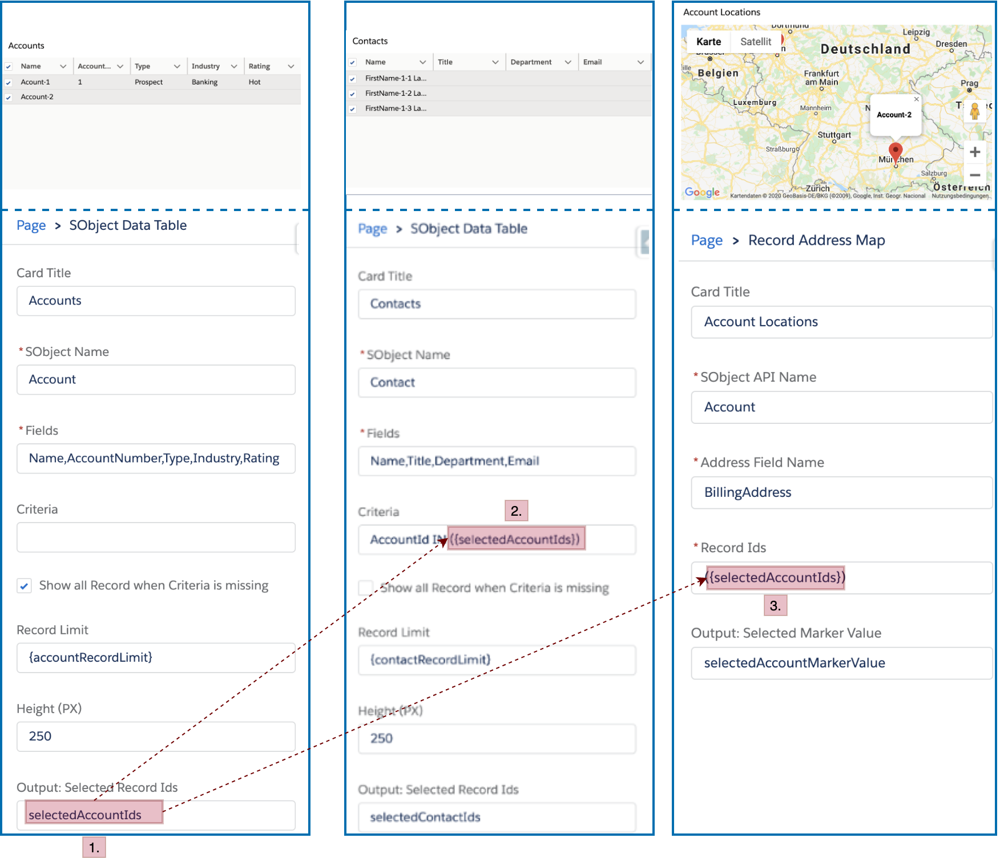
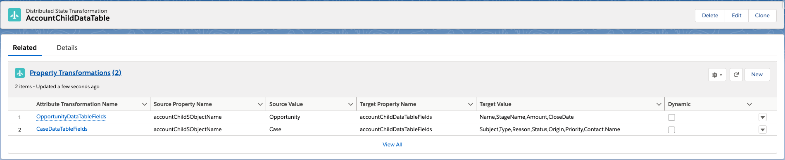
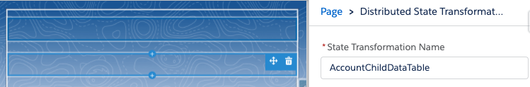

[](https://github.com/Oliver-Preuschl/lwc-das/actions)
[](https://github.com/Oliver-Preuschl/lwc-das/actions)
[](https://codecov.io/gh/Oliver-Preuschl/lwc-das)


# Overview

lwc-das enables you to build generic, loosely coupled Lightning Web Components (LWCs). The communication between these components can be configured directly in the Lightning App Builder using incoming and outgoing properties, instead of sending dedicated messages between the single components. This leads to a much higher component reusability and cleaner component architecture.

For a detailed explanation of the motivation behind this project and an overview of the architecture please read the article [Loose Coupling of LWCs in the Lightning App Builder](https://medium.com/p/a1b37cad3575) on Medium.

# Installation

## Installation in a scratch org (with examples)

1. Clone the repository

   ```bash
   git clone https://github.com/Oliver-Preuschl/lwc-das
   cd lwc-das
   ```

1. Create a new scratch org

   ```bash
   sfdx force:org:create -s -f config/project-scratch-def.json -a lwc-das
   ```

1. Push to your scratch org

   ```bash
   sfdx force:source:push
   ```

1. Import the sample data

   ```bash
   sfdx force:data:tree:import -p ./data/sample-data-plan.json
   ```

1. Open the scratch org

   ```bash
   sfdx force:org:open
   ```

## Installation in any org (without examples)

The unlocked package to install lwc-das in a sandbox or production org can be found [here](https://login.salesforce.com/packaging/installPackage.apexp?p0=04t09000000FipUAAS). Note, that this will just install the library itself, not the example components or the example application.

# Usage in the Lightning App Builder

Components built with lwc-das usually provide incoming and outgoing properties. You can set the name for an outgoing property in the Lightning App Builder and then refer to this property in the incoming properties of any other component in the page. This enables communication between these components without modifying the component itself. The outgoing properties have to be surrounded by curly braces when used in incoming properties. Note, that this does not necessarily work for every incoming property, but just for those that were registered as _dynamic properties_. The following illustration explains this concept based on an example application which displays 3 interconnected components.

- An account data table which displays all available accounts.
- A contact data table which displays all contacts for the selected accounts.
- A location map component which displays the locations of the selected accounts.



1. The account data table specifies the outgoing property _selectedAccountIds_
2. This property is then used in the incoming property _criteria_ to filter the contact records in the contact data table.
3. The same property is used to pass the account ids to the location map component.

# Implementation

The easiest way to enable a component for communication using properties is to simply wrap an existing component. Please find below an overview of the necessary steps to wrap the _lightning-map_ component.
For complete examples, please refer to the [LWC samples](force-test/main/default/lwc/).

1. Wrap the desired Component

   ```js
   <template>
     <lightning-card title={cardTitle}>
       <p class="slds-p-horizontal_small">
         <lightning-map
           map-markers={mapMarkers}
           list-view="hidden"
           onmarkerselect={handleMarkerSelect}
         ></lightning-map>
       </p>
     </lightning-card>
   </template>
   ```

1. Use the Mixin _DistributedApplicationStateMixin_.

   ```js
   import { DistributedApplicationStateMixin } from "c/distributedApplicationState";

   export default class DeclarativeAddressMap extends DistributedApplicationStateMixin(LightningElement){
     ...
   }
   ```

1. Declare the (incoming) dynamic properties and the outgoing properties. Please note, that currently properties of type _string_ are supported.

   ```js
   //Incoming
   @api cardTitle;
   @api sObjectApiName;
   @apiaddressFieldName;
   @api recordIds;

   //Outgoing
   @api selectedMarkerValuePropertyName;
   ```

1. Register the dynamic properties of your component to make sure that [lwc-das](https://github.com/Oliver-Preuschl/lwc-das) will update these properties whenever the state gets updated by another component. Besides the name of the property, you can choose to empty the property whenever a property cannot be resolved (`emptyIfNotResolvable: true`) or to null it (`nullIfNotResolvable: true`), which is the default.

   ```js
   connectedCallback() {
     this.startStateHandling({
       dynamicProperties: [
         { name: "cardTitle", emptyIfNotResolvable: true },
         { name: "sObjectApiName", emptyIfNotResolvable: true },
         { name: "addressFieldName", emptyIfNotResolvable: true },
         { name: "recordIds", emptyIfNotResolvable: true }
       ]
     });
   }
   ```

1. Stop the state handling when your component gets disconnected.

   ```js
   disconnectedCallback() {
     this.stopStateHandling();
   }
   ```

1. Publish state changes of your component.

   ```js
   handleMarkerSelect(event) {
     this.publishStateChange(
       this.selectedMarkerValuePropertyName,
       event.detail.selectedMarkerValue
     );
   }
   ```

## Property Initialization

Dynamic properties which are assigned a value using the Lightning App Builder may initially contain property names from other components.
To avoid potential errors these property values will initially be cleared.
In most cases you will want to wait for this initialization before displaying a component or fetching data.

To support you with this, lwc-das provides the property _isStateInitialized_.
This property can be used either in the HTML markup (`<component if:true={isStateInitialized}>...</component>`) or in the javascript code (`if(this.isStateInitialized){...}`). For examples please see the components [declarativeAddressMap](force-test/main/default/lwc/declarativeAddressMap) and [declarativeSObjectDataTable](force-test/main/default/lwc/declarativeSObjectDataTable).

Additionally you can implement the lifecycle hook _stateInitializedCallback_ which will be called after the state was initialized.

```js
stateInitializedCallback() {
    this.calculateMarkers();
  }
```

# Component Object and Record Context

To ensure you can also use your components on record pages lwc-das provides the possibility to use the public properties _sObjectApiName_ and _recordId_ in your incoming properties.
You could, for example, use the following value for the property _criteria_ of a contacts data table on the account record page to show all contacts related to this account: `AccountId = '{recordId}'`

# State Transformations

The unity of all outgoing properties form the _distributed application state_. However, in some cases it may be required to add additional properties to the state or modify existing ones. One examplary use case could be to change the visible fields in a data table depending on the chosen sObject name.
Those state transformations can be built declaratively using the custom objects _Distributed State Transformation_ and _Property Transformation_. A single _Property Transformation_ (1.) specifies a value for an additional state property whenever an existing state property changes to a specific value. A _Distributed State Transformation_ record (1.) specifies a set of _Property Transformations_ to make them accessible in the Lightning App Builder using the component _Distributed State Transformation_ (2.).


_1. Distributed State Transformation with Property Transformations_


_2. Including the Distributed State Transformation in the Lightning App Builder_

For a complete example see the [sample app page](force-test/main/default/flexipages/Distributed_Application_State_Examples.flexipage-meta.xml).
